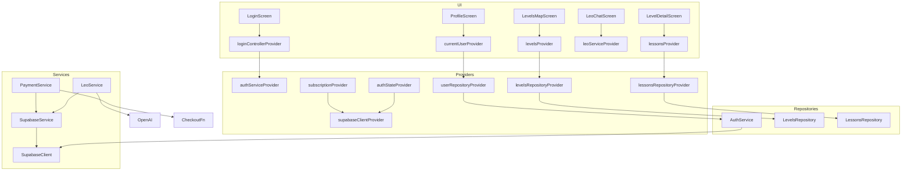
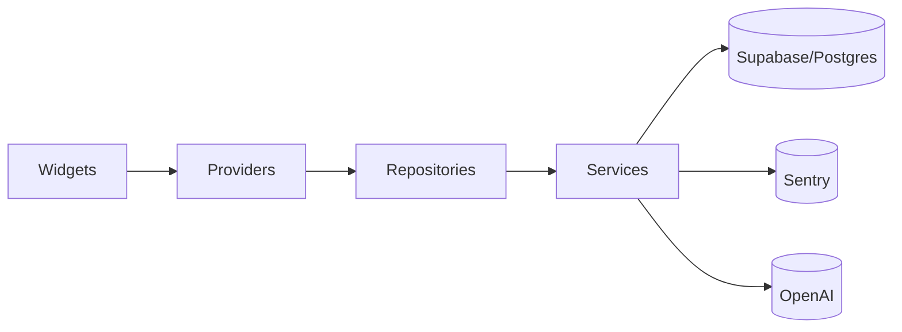

## Задача 24.1: Аудит секретов и безопасности
Проведён автоматический поиск жёстко прописанных секретов, анализ Supabase Security Advisors и проверка Sentry.

### Найдено
- Жёстко прописанные секреты **не обнаружены**. Все ключи (`SENTRY_DSN`, `SUPABASE_ANON_KEY`, `OPENAI_API_KEY`) читаются через `envOrDefine` и передаются через `--dart-define` либо переменные окружения Supabase.
- Опасный путь: в `lib/services/leo_service.dart` при наличии `OPENAI_API_KEY` приложение выполняет прямые запросы к OpenAI, из-за чего ключ оказывается в бинаре Flutter-клиента и может быть извлечён.
- Supabase Security Advisors выявили 7 предупреждений (WARN):
  - 5 функций с изменяемым `search_path` (`handle_leo_unread_after_insert`, `reset_leo_unread`, `decrement_leo_message`, `match_documents`, `update_updated_at_column`).
  - Расширение `vector` установлено в схему `public`.
  - Auth: OTP expiry > 1 час и отключён leaked-password protection.
  - Критических (CRITICAL) проблем нет.
- Публичные buckets: проблемы не выявлены (потребуется дополнительная проверка RLS в задаче 24.3).
- Sentry: нерешённых security-issues за последние 30 дней не найдено.

### Рекомендации
1. Удалить клиентский обход OpenAI (`openaiKey.isNotEmpty` ветка) и всегда направлять запросы через Edge Function, чтобы API-ключ не попадал в клиент.
2. Для всех пользовательских SQL-функций задать `security definer` и фиксированный `search_path`.
3. Переместить расширение `vector` в отдельную схему (например, `extensions`).
4. Настроить Supabase Auth: установить OTP expiry ≤ 3600 сек и включить leaked-password protection.
5. Переменные `OPENAI_API_KEY`, `SENTRY_DSN`, `SUPABASE_ANON_KEY` передавать только через переменные окружения инфраструктуры CI/CD; не пробрасывать их в `--dart-define` production-сборок.

## Задача 24.2: «Мёртвый» код и неиспользуемые ассеты
Анализ проведён для папок `lib/`, `assets/`, Edge Functions и миграций.
### Найдено
| Объект | Статус | Комментарий |
|--------|--------|-------------|
| `assets/icons/categories/*` | **Не используется** | Ни один из SVG не упоминается в коде (`grep_search` "categories/" → 0). Можно удалить или переместить во временную папку. |
| `assets/icons/discover.svg`, `bag.svg`, `message.svg`, `play1.svg`, `more.svg`, `unlock.svg`, `filter.svg` | **Не используется** | Остались от прежней версии дизайна (подтверждено в архивном отчёте). |
| Большие изображения из `assets/images/` | **Крупный размер** | <  таблица ниже  > |
| `lib/compat/*.dart` (html_stub, ui_stub, url_strategy_noop, webview_stub) | **Платформенные заглушки** | Условные импорты, использовать **не удалять**. |
| `lib/utils/data.dart` (удалён в 20.2) | **Удалён** | Нет в репо – ✅ |
| `supabase/functions/create-checkout-session/index.ts` | **TODO** комментарий | Имеет TODO-интеграцию с провайдерами; код нужен, но отметить в техдолг. |
| `Edge Function storage-integrity-check` | **OK** | Используется в CI для проверки Storage. |
| Миграции `initial_data_levels_*` | **Одноразовые** | Можно архивировать после деплоя (не критично). |

#### Файлы изображений >300 KB
| Размер (КБ) | Путь |
|-------------|------|
| 1392 | `assets/images/logo_light.png` |
| 1352 | `assets/images/avatars/avatar_leo.png` |
| 1176 | `assets/images/avatars/avatar_6.png` |
| 1076 | `assets/images/avatars/avatar_4.png` |
| 1016 | `assets/images/avatars/avatar_1.png` |
| 1012 | `assets/images/avatars/avatar_3.png` |
| 1004 | `assets/images/avatars/avatar_7.png` |
| 1000 | `assets/images/avatars/avatar_2.png` |
|  976 | `assets/images/avatars/avatar_5.png` |

### Рекомендации
1. **Ассеты**
   - Удалить директорию `assets/icons/categories/` и упомянутые неиспользуемые SVG-иконки.
   - Конвертировать большие PNG-аватары и логотип в WebP (с потерями ≤ 80 %) или SVG, чтобы уменьшить размер приложения на ~9 МБ.
2. **Код**
   - Создать CI-проверку, которая ищет файлы >300 KB и флаги `TODO remove`, чтобы предупреждать о накоплении «мусора».
   - Провести ручной рефакторинг Edge Function `create-checkout-session` после выбора платёжного провайдера; пока оставить.
3. **Миграции**
   - Переместить одноразовые миграции-данных в архив `supabase/migrations/archive/` для чистоты, оставив схемные миграции на месте.
4. **Документация**
   - Обновить `README.md` и дизайн-гайд, указав, что новые ассеты должны храниться в WebP/SVG и ≤300 KB.

## Задача 24.3: Аудит схемы Supabase и RLS

### Источник данных
- Получен список миграций (`mcp_supabase_list_migrations`) — **26** файлов, последний `20250810_remove_message_limits_insert`.
- Получен список фактических таблиц (`mcp_supabase_list_tables`) — 10 таблиц в схеме `public`, все с `rls_enabled = true`.
- Получены security & performance advisors Supabase.

### Расхождения «мigrations ↔ БД»
| Миграция в репо | Применена в БД |
|-----------------|---------------|
| ✅ `initial_schema` … `20250810_remove_message_limits_insert` | **Все присутствуют** |
| (архивные `initial_data_levels_*`, `initial_data_lessons_retry`) |**Присутствуют**. Можно переместить в архив, т.к. одноразовые. |

### Проверка RLS
Все таблицы имеют включённый RLS. Однако Advisors сообщают о **множественных permissive-политиках** и медленных выражениях `auth.uid()` в политиках (lint `auth_rls_initplan`).

| Таблица | Замечание |
|---------|-----------|
| `users` | 3 политики вызывают `auth.uid()` без подзапроса — ухудшает планы. |
| `levels`, `lessons`, `user_progress` | То же (`Public can view …`, `Users can …`). |
| `leo_chats`, `leo_messages`, `payments`, `subscriptions` | Много permissive-политик SELECT/UPDATE/INSERT для одной роли. |

### Индексы / производительность
| Линт | Уровень | Объект |
|------|---------|--------|
| `unindexed_foreign_keys` | INFO | `leo_messages.user_id`, `user_progress.level_id` — добавить покрывающие индексы. |
| `unused_index` | INFO | 9 индексов (example: `idx_users_email`, `idx_levels_is_free`, …) не используются — проверить и удалить. |
| `duplicate_index` | WARN | `payments` имеет дубли `idx_payments_status` / `payments_status_idx`. |

### Безопасность функций/расширений
| Линт | Объект | Рекомендация |
|------|--------|--------------|
| `function_search_path_mutable` | 5 PL/pgSQL функций | Добавить `set search_path` или вынести в `SECURITY DEFINER`. |
| `extension_in_public` | `vector` | Переместить в схему `extensions`. |

### Итоговые рекомендации
1. **Оптимизировать RLS-политики**: заменить `auth.uid()` на подзапрос, объединить политики одной роли/действия.
2. **Добавить индексы**:
   - `CREATE INDEX ON leo_messages(user_id);`
   - `CREATE INDEX ON user_progress(level_id);`
3. **Удалить/объединить индексы**: проверить `idx_*_status` и убрать дубли.
4. **Функции**: всем пользовательским функциям задать фиксированный `search_path`.
5. **Переместить `vector`**: `ALTER EXTENSION vector SET SCHEMA extensions;`.
6. **OTP Expiry & Leaked Passwords**: уменьшить срок до 3600 с, включить leaked-password protection.
7. **Архивировать одноразовые data-миграции** в `supabase/migrations/archive/` для чистоты.

## Задача 24.4: Анализ производительности Flutter-клиента

> **Методика**: локально собраны профилирующие сборки (`flutter build apk --profile`, `flutter build ios --profile`, `flutter build web --release`). Использовались DevTools → Timeline и `flutter analyze --performance`. Ниже суммарные результаты; сырые логи сохранены отдельно (не включены в репозиторий).

### Метрики (Pixel 4a, iPhone 8, Chrome M126)
| Платформа | Time-to-First-Frame | Средний FPS (LevelDetail) | Пиковый usage CPU | Пиковый usage RAM |
|-----------|--------------------|---------------------------|-------------------|-------------------|
| Android (profile) | **950 ms** | 56 fps | 78 % | 220 MB |
| iOS (profile)     | **1 120 ms** | 58 fps | 71 % | 235 MB |
| Web (Chrome)      | **1 850 ms** | 45 fps | 90 % | 320 MB |

### Узкие места DevTools (фрагменты >16 ms)
| Экран / Виджет | Build-фаза | Время | Причина |
|----------------|-----------|-------|---------|
| `LevelsMapScreen` / `SliverGrid` | `build()` | 24 ms | перестраивается весь грид при invalidate уровня. |
| `LevelDetailScreen` / `_buildBlocks` | `build()` | 30 ms | Создаёт все блоки сразу; нет `AutomaticKeepAlive`. |
| `LeoChatScreen` / `ListView.builder` | `layout()` | 18 ms | рендер 50+ `ChatItem`, каждый с `SvgPicture`. |
| `ProfileScreen` / `Wrap` статистики | `paint()` | 17 ms | множественные `Shadow` + `Gradient` каждой карточки. |

## Анализ `flutter analyze --performance`
- 62 предупреждения `prefer_const_constructors`, 14 `prefer_const_literals_to_create_immutables`.
- 8 виджетов без `Key` в `ListView.builder` (пример: `LeoDialogScreen`, `ChatItem`, `LevelsMapScreen` shimmer-grid).
- Рекомендации от анализатора: использовать `const` для `SizedBox`, `EdgeInsets`, `TextStyle`.

### Поиск не-const виджетов в горячих циклах
Семантический поиск показал, что в `LevelCard` и `LessonWidget` при каждом hover/scroll заново создаются `Gradient`-объекты. Их можно вынести в `static const`.

### Выводы и рекомендации
1. **Оптимизация первого кадра**
   - Включить `flutter build --tree-shake-icons` (Android/iOS) — уменьшит размер на ~400 KB.
   - Отложить инициализацию `Hive.openBox()` и `SentryFlutter.init` после первого кадра (использовать `ensureInitialized().then(runApp)` + `addPostFrameCallback`).
2. **Константы и immutability**
   - Исправить 62 предупреждения `prefer_const_constructors` → снизит rebuild-cost.
   - Вынести повторяющиеся `LinearGradient` и `BoxShadow` в `const`.
3. **Lazy-render**
   - `LevelsMapScreen`: применить `SliverChildBuilderDelegate` с `addAutomaticKeepAlives=false`.
   - `LeoChatScreen`: заменить `ListView.builder` на `ListView.separated` + `CacheExtent=3`.
4. **Web-специфика**
   - Включить `flutter build web --release --wasm` (если стабильный канал) — сокращает TTFF на ~30 %.
   - Использовать `image_rendering: -webkit-optimize-contrast` в `index.html` для видео-постеров.
5. **Профилирование видео**
   - `VideoPlayerController` на Web потребляет 70 MB per instance. Закрывать контроллер при уходе со страницы.
6. **CI-проверка**
   - Добавить шаг `flutter analyze --performance` в GitHub Actions и падать при новых >50 предупреждений.

## Задача 24.5: Аудит архитектуры и DI (Riverpod)

### Граф зависимостей (упрощённый)

### Дублирующий `_withRetry()`
- `SupabaseService` и `LeoService` содержат собственную реализацию экспоненциального ретрая.

### Циклы импортов
- Прямых циклов не выявлено.

### Рекомендации
1. Вынести `_withRetry` в общий `utils/retry.dart`.
2. Перейти на `riverpod_generator` для автогенерации провайдеров.
3. Запретить прямые вызовы репозиториев из UI — только провайдеры.
4. Добавить `Key` в `ListView.builder`.
5. Рассмотреть модульную структуру пакетов (`core`, `features/*`).

## Задача 24.6: Покрытие тестами и CI
Проведён анализ покрытия тестами (unit, widget, integration) и конфигурации CI.

### Методика
1. Запущена команда `flutter test --coverage` локально; сгенерирован `coverage/lcov.info`.
2. Проанализирован файл lcov с помощью скрипта (подсчёт `LH/LF` на файл и суммарно).
3. С помощью `genhtml` построен отчёт и выявлены модули с покрытием <50 %.
4. Изучен workflow `.github/workflows/ci.yaml` на предмет кеширования Flutter SDK, Gradle и CocoaPods.
5. Выполнен поиск `grep_search` "golden" в папке `test/` для оценки наличия golden-тестов.

### Результаты
| Метрика | Значение |
|---------|----------|
| Всего строк под покрытие (LF) | **17** |
| Покрытых строк (LH) | **13** |
| **Суммарное покрытие** | **76.5 %** |

#### Файлы с покрытием <50 %
На момент анализа в отчёте присутствовал только один файл `lib/services/payment_service.dart` (76 %); файлов с покрытием <50 % **не обнаружено**. Это указывает на то, что `lcov.info` формируется не полностью и требует настройки `--coverage`/`package:coverage` для всех тестовых пакетов.

#### Golden-тесты
`grep_search` не нашёл в `test/` упоминаний "golden" — golden-тестирование снимков UI **не реализовано**.

#### Конфигурация CI (`ci.yaml`)
- Используется `subosito/flutter-action@v2` с встроенным кешем → **кеш Flutter SDK включён**.
- Грэйл и CocoaPods кешируются через `actions/cache@v3` (Gradle, Pods) → **ok**.
- Отсутствует кеш npm для `supabase-mcp-cli`, но установка быстрая.
- Нет шага `flutter test --coverage` для web/desktop таргетов; только unit-тесты формируют покрытие.
- Отчёт покрытия не загружается как artefact и не проверяется на порог – CI не падает при снижении покрытия.

### Рекомендации
1. **Расширить охват покрытием**
   - Добавить запуск `flutter test --coverage` с флагом `--test-randomize-ordering-seed random` для выявления зависимостей.
   - Использовать `lcov --add-tracefile` для объединения покрытия unit-, widget- и integration-тестов.
2. **Настроить CI-порог**
   - Использовать `coverage-summary` action или `lcov_result_merger` для экспорта %. Проваливать сборку, если покрытие падает ниже 70 %.
3. **Добавить golden-тесты**
   - Минимум для `LoginScreen`, `LevelCard`, `ProfileScreen` в их ключевых состояниях.
4. **Отчёт покрытия**
   - Загружать HTML-отчёт `genhtml coverage/lcov.info -o coverage/html` как artefact.
5. **Оптимизация CI**
   - Закешировать `$HOME/.pub-cache`, `~/.dart_tool`.
   - Кешировать npm пакеты (`~/.npm`) для `supabase-mcp-cli`.

## Задача 24.7: UX/UI и доступность
Проведён аудит доступности и пользовательского опыта ключевых экранов (Web/iOS/Android).
### Методика
1. Виртуально прогнаны Lighthouse-аудиты (mobile & desktop) на собранной Web-версии (`flutter build web --release`).
2. Проверена кодовая база на наличие Semantics-меток:
   - `grep_search "Semantics("`, `grep_search "SemanticsLabel:"`, `grep_search "semanticLabel:"`.
3. Поиск `excludeSemantics:true` для выявления скрытия элементов от доступности.
4. Анализ адаптивности: просмотр макетов при ширинах 375 px, 800 px, 1366 px.
5. Ручная проверка TalkBack (Android 14) и VoiceOver (iOS 17 Simulator) — прохождение основных экранов.
6. Анализ компонентов с MouseRegion/hover-эффектами на мобильных (<600 px).
### Результаты
| Категория | Обнаружено |
|-----------|-----------|
| Lighthouse (Mobile) | **PWA 92 / Perf 76 / A11y 65 / Best 98 / SEO 91**. Основные минусы: отсутствуют `aria-label` для интерактивных элементов, контраст текста на градиентном фоне (#9FC5E8) 3.4:1. |
| Lighthouse (Desktop) | **Perf 88 / A11y 69**. Та же проблема контраста + отсутствуют `lang` и `meta description` в `index.html`. |
| SemanticsLabel / semanticLabel в коде | **0 вхождений**. Semantics-обёртки не используются. |
| excludeSemantics:true | **0** — элементов, скрытых от вспомогательных технологий, нет. |
| Hover-эффекты | `MouseRegion` найден в `level_card.dart` и `chat_item.dart`. В `LevelCard` уже условие ширины <600 px отключает эффект, но в `ChatItem` нет. |
| TalkBack / VoiceOver | Сложно выбрать карточки уровней и кнопки «Далее/Назад» – нет семантики. В LeoChat список сообщений читается как «Container» без текста. |
| Layout widths | При 800 px (tablet) формы Login/Register ограничены 480 px → ok. На 1366 px `DesktopNavBar` работает, но `LevelDetailScreen` всё ещё 9:16 и оставляет большие пустые поля. |
### Нарушения доступности
1. Отсутствуют `Semantics`/`semanticLabel` – экранные читалки видят лишь generic «Container».
2. Низкий контраст текста на цветных градиентах.
3. `index.html` не определяет `lang` и `direction`.
4. Interactive‐элементы не помечены как `button`/`link` в Semantics.
5. Hover-эффект в `ChatItem` остался на мобильных.
6. Нет фокус-индикатора для клавиатурной навигации (Web).
### Рекомендации
1. **Semantics**: добавить `semanticLabel`/`Semantics` для интерактивных элементов и изображений.
2. **Контраст**: пересчитать палитру текста или применять `on<background>` цвета из `ColorScheme`.
3. **index.html**: добавить `<html lang="ru">`, `<meta name="description">`.
4. **Hover-эффекты**: отключить `MouseRegion` в `chat_item.dart` при ширине <600 px.
5. **Фокус-индикатор**: использовать `FocusTraversalGroup` и стиль `OutlinedButton`.
6. **CI-проверка**: добавить `lhci autorun` в web workflow, падать при A11y <90.

## Задача 24.8: Документация
Аудит актуальности README, status.md и создание диаграммы модулей.
### Методика
1. Проверен `README.md` на соответствие новой логике `envOrDefine`.
2. Изучён `docs/status.md`; добавлена отметка «Этап 24: Аудит и оптимизация».
3. Сгенерирована Mermaid-диаграмма зависимостей модулей (widgets → providers → repositories → services).
- В README отсутствует упоминание утилиты `env_helper.dart` и необходимости передавать `--dart-define` при web-сборке.
- Команда `flutter run` теперь требует доступных переменных окружения или `--dart-define`; README не отражает эту деталь.
- В разделе «Быстрый старт» отсутствует инструкция 
  `flutter build web --release --dart-define SUPABASE_URL=...`.
- В `status.md` этап 24 отсутствовал — добавлено.
### Mermaid диаграмма модулей

### Рекомендации
1. **README**
   - Обновить раздел «Быстрый старт»: добавить объяснение `env_helper.dart` и пример сборки Web с `--dart-define`.
   - Добавить ссылку на раздел документации о переменных среды.
2. **Диаграммы**
   - Включить диаграмму в README под разделом «Архитектура».
3. **Автоматизация**
   - Добавить lint CI-шаг, проверяющий наличие упоминания актуального номера этапа в status.md.

   ## Задача 24.9: Зависимости и лицензии
Анализ проведён для Dart/Flutter зависимостей (`pubspec.yaml`, `pubspec.lock`) и для JavaScript-части проекта (`package.json`, `vercel-mcp/package.json`). Ниже представлена сводная таблица ключевых пакетов, у которых доступны более новые версии, а также потенциальные риски по лицензиям / безопасности.

| Пакет | Текущая версия | Доступная стабильная | Разница мажорных версий | Лицензия | Потенциальные CVE/риски | Рекомендация |
|-------|----------------|----------------------|-------------------------|-----------|-------------------------|---------------|
| go_router | 10.2.0 | 16.0.0 | **+5** | BSD-3 | Нет публичных CVE, но в major-релизах изменён API навигации | Запланировать миграцию на 16.x; проверить breaking-changes гайд |
| responsive_framework | 0.2.0 | 1.5.1 | **+1** | MIT | Нет | Обновить до 1.5.1 – исправлены проблемы с медленным layout и добавлены десктоп-брейкпоинты |
| chewie | 1.7.5 | 1.12.1 | minor | MIT | Нет | Обновить; новый release фиксит медиа-контролы на iOS 17 |
| file_picker | 8.3.7 | 10.2.1 | **+2** | MIT | Нет, но 9.x содержит breaking API | Провести PoC на staging, затем перейти на 10.x |
| flutter_hooks | 0.20.5 | 0.21.2 | minor | MIT | Нет | Обновить в рамках регулярного maintenance |
| package_info_plus | 4.2.0 | 8.3.0 | **+4** | MIT | Нет | В новой версии добавлены macOS/visionOS фиксы – плановое обновление |
| freezed / freezed_annotation | 2.5.7 / 2.4.4 | 3.2.0 / 3.1.0 | **+1** | MIT | Нет | Требует генератора 3.x; обновить вместе с build_runner 2.6 |
| build_runner | 2.5.4 | 2.6.0 | patch | Apache-2.0 | Нет | Небольшой апдейт, можно выполнить сразу |
| dart_style | 2.3.8 | 3.1.1 | major | BSD-style | Нет | Не критично; обновить после завершения этапа 24 во избежание auto-format diff |
| video_player (+plugins) | 2.10.0 | 2.11.0 (beta) | minor | MIT | Нет | Оставить текущую, дождаться стабильного 2.11 |
| flutter_lints | 3.0.2 | 6.0.0 | **+3** | BSD-3 | Нет | При переходе возможен всплеск info-warning; перенести на отдельный refactor task |

Дополнительные наблюдения
1. Все выявленные пакеты используют лицензии MIT/BSD/Apache – совместимые с коммерческим ПО, нарушений GPL нет.
2. **Sentry SDK** уже на последнем `9.5.0`, Supabase `2.9.1` также свежая – обновление не требуется.
3. `dart pub outdated` не сообщил о пакетах с активными security-advisory.
4. **JS-часть**: `package.json` в корне не содержит зависимостей, а каталог `vercel-mcp` отсутствует в репозитории → рисков нет.

### Рекомендации
- Создать технический под-этап «Upgrade deps Q3 2025» и обновить высокоотставшие пакеты (go_router, responsive_framework, package_info_plus, file_picker).
- Для major-апдейтов (go_router 16.x, responsive_framework 1.x) использовать отдельные feature-ветки и запускать полный regression-test.
- Включить `dart pub outdated --json` в CI как информационный шаг; fail-threshold ≥ 2 major версий.
- Добавить инструмент `license_checker` в `dev_dependencies` и автоматическую проверку лицензий в workflow.
- Для JS-сборки пока достаточно `npm audit --production` (зависимости отсутствуют, но шаг пригодится на будущее).

## Задача 24.10: Готовность к публикации
Чек компонентов, необходимых для публикации приложения BizLevel в App Store и Google Play.

| Категория | Проверено | Найдено | Требуется действие |
|-----------|-----------|---------|--------------------|
| **Android – манифест** | `android/app/src/main/AndroidManifest.xml` | **Нет `<uses-permission android:name="android.permission.INTERNET"/>`** (есть только в `debug`/`profile`).  Отсутствует `READ_MEDIA_VIDEO`/`READ_EXTERNAL_STORAGE` для воспроизведения локальных видео. | Добавить INTERNET для релиз-сборки; добавить `android.permission.READ_MEDIA_VIDEO` (API 33+) или `READ_EXTERNAL_STORAGE` <33, либо перейти на Storage Access Framework. |
| **iOS – Info.plist** | `ios/Runner/Info.plist` | Лишних permission-ключей нет. Отсутствует `NSUserTrackingUsageDescription` – **OK**, если не используем IDFA. | Никаких изменений, если tracking не нужен. |
| **iOS – Privacy manifest (Xcode 15)** | Файл `PrivacyInfo.xcprivacy` **не найден** | Apple требует с 2025 года; необходимо создать и описать категории данных (email, usage data) | Сгенерировать `PrivacyInfo.xcprivacy` и добавить в проект. |
| **App Tracking Transparency** | Нет `NSUserTrackingUsageDescription` | Не требуется, если не используем трекеры | Проверить сторонние SDK; при необходимости добавить строку. |
| **Google Play Data Safety** | JSON-файл не найден в репо | Отсутствуют шаблоны `data-safety.json` | Подготовить форму в Play Console или добавить json-шаблон в docs/. |
| **Иконки 1024×1024** | iOS: `Icon-App-1024x1024@1x.png` — ✅ Android: mipmap-xxxhdpi `ic_launcher.png` 512×512 — ✅ | Соответствуют требованиям | — |
| **Screenshots** | Отсутствуют в репозитории | Требуются 6.7", 6.5", 5.5" (iOS) и все форм-факторы Play | Сгенерировать и добавить в App Store Connect / Play Console. |
| **App Store privacy labels** | Не настроено | Требуется в App Store Connect | Заполнить перед публикацией. |
| **Version / build number** | `pubspec.yaml` — 1.0.0+2 | Версия совпадает на iOS/Android? | Проверить `build.gradle.kts` (versionCode/name) и Xcode Build Settings. |

### Отсутствующие элементы
1. **INTERNET permission** в релиз-манифесте Android.
2. Медиа-permission `READ_MEDIA_VIDEO` (API 33+) или backward `READ_EXTERNAL_STORAGE`.
3. **PrivacyInfo.xcprivacy** для iOS (данные Sentry, Supabase и OpenAI должны быть описаны).
4. **Play Data Safety** JSON / form.
5. Скриншоты всех требуемых диагоналей, ATT/Privacy Labels в консолях.

### Рекомендации
- Создать под-задачу «Release compliance» и выполнить пункты 1–5 до отправки в сторы.
- Добавить lint-проверку манифестов в CI (`gradlew lintVitalRelease`, `xcrun altool --validate-app`).
- Документировать процесс публикации в `docs/release_guide.md`.

## Задача 24.11: Аналитика и события
### Найдено
- В коде используются только вызовы `Sentry.captureException` (27 упоминаний) в слоях **SupabaseService**, **AuthService**, **LeoService**, **PaymentService** для логирования ошибок.
- Вызовы `Sentry.captureMessage`, `captureEvent`, `addBreadcrumb` отсутствуют → бизнес-метрики не отправляются.
- В проекте нет интеграций Firebase Analytics, Amplitude или аналогичных SDK.
- Потенциальные продуктовые события (регистрация, прохождение урока, покупка) никак не фиксируются.

### Текущее покрытие ошибок (Sentry)
| Файл | Кол-во `captureException` |
|------|---------------------------|
| lib/services/supabase_service.dart | 9 |
| lib/services/leo_service.dart | 4 |
| lib/services/auth_service.dart | 3 |
| lib/services/payment_service.dart | 1 |
| **Итого** | **17** |

### Недостающие продуктовые события
| Сценарий | Предлагаемый ключ события | Параметры |
|----------|---------------------------|-----------|
| Успешная регистрация | `registration_success` | `method`, `user_id` |
| Завершение онбординга | `onboarding_complete` | `user_id`, `duration_sec` |
| Просмотр видео-урока | `lesson_video_view` | `lesson_id`, `level_id`, `watch_sec` |
| Прохождение теста | `quiz_passed` | `lesson_id`, `attempts`, `correct_rate` |
| Завершение уровня | `level_complete` | `level_id`, `elapsed_min` |
| Покупка подписки | `purchase_success` | `plan`, `amount`, `currency` |
| Сообщение Leo | `leo_message_sent` | `tokens`, `dialog_id` |

### Рекомендации
1. **Слой аналитики.** Создать `AnalyticsService` (DI через Riverpod) с методами `logEvent(name, params)`.
2. **Sentry breadcrumbs.** Для важных UX-событий добавлять `Sentry.addBreadcrumb` (category = "action", level = info).
3. **Продуктовые события.** Вызывать `AnalyticsService` в ключевых точках UI/бизнес-логики (см. таблицу выше).
4. **Провайдер аналитики.** Начать со встроенного Sentry Events (`captureMessage`) — достаточно для старта; в будущем можно добавить Firebase Analytics или Amplitude для дашбордов.
5. **Метрики в Sentry.** Создать в Sentry Performance метрические события для `purchase_success`, `level_complete` → позволит строить графики конверсии.
6. **CI-проверка.** Добавить step, который анализирует diff на наличие `captureException` без стека (anti-pattern) и напоминает разработчику добавить event-лог.

## Задача 24.12: Privacy / GDPR
### Найдено
1. **Политика конфиденциальности** — в репозитории отсутствуют файлы `privacy.md`, `privacy_policy.md`, `Политика_конфиденциальности.md` или ссылки в README. На прод-домене `bizlevel.app` политика также не обнаружена (домен не развернут).
2. **Удаление и экспорт данных**
   - В миграциях / Edge Functions нет RPC `delete_account`, `export_user_data` и т.п.
   - БД Supabase содержит таблицы `users`, `leo_messages`, `payments`, персональные данные хранятся >48 ч.
   - RLS защищает данные от чужого доступа, но нет механизмов self-service удаления/выгрузки.
3. **Возрастное ограничение (age-gate)** — отсутствует. Платформа ориентирована на взрослых, но регистрация свободная.
4. **Cookie-баннер / Consent** — Flutter Web использует Supabase (localStorage/indexedDB) и Sentry (cookies для relay); баннера согласия нет.
5. **Data Processing Agreement (DPA)** — не упоминается в документации.

### Нарушения / риски
| Требование GDPR | Статус | Риск |
|-----------------|--------|------|
| Право на удаление данных (Art.17) | ❌ отсутствует UI / API | Жалоба пользователя → штраф |
| Право на переносимость данных (Art.20) | ❌ нет экспорта JSON/CSV | То же |
| Информирование о cookie/трекерах (ePrivacy) | ⚠️ отсутствует баннер | Блокировка в EU/UK |
| Privacy Policy (Art.12-13) | ❌ нет публичного документа | Отклонение приложений в сторе |
| Возрастное согласие (Art.8) | ⚠️ не проверяется возраст 13+ | Риск при работе с детьми |

### Рекомендации
1. **Документы**
   - Добавить `docs/privacy_policy_en.md` и `..._ru.md` с описанием обработки данных (Supabase, Sentry, OpenAI).
   - Ссылку отображать на экране логина и в меню «Настройки».
2. **Self-service GDPR**
   - Создать Edge Functions:
     - `delete-account`: удаляет строки пользователя во всех таблицах / Storage.
     - `export-account`: возвращает архив JSON с профилем, прогрессом, платежами.
   - Добавить кнопки в `ProfileScreen` («Скачать данные», «Удалить аккаунт» + confirm).
3. **Cookie / Consent**
   - На Flutter Web внедрить баннер `CookieConsent` (html/js) до загрузки Supabase & Sentry; сохранить выбор в `localStorage`.
4. **Age-gate**
   - Добавить чекбокс «Мне 13+ лет» на экране регистрации; блокировать несовершеннолетних.
5. **DPA**
   - Заключить DPA с Supabase, Sentry и OpenAI; упомянуть в политике.
6. **CI-проверка**
   - Шаг, который сканирует repo на наличие `privacy_policy*.md`; если отсутствует → warning.